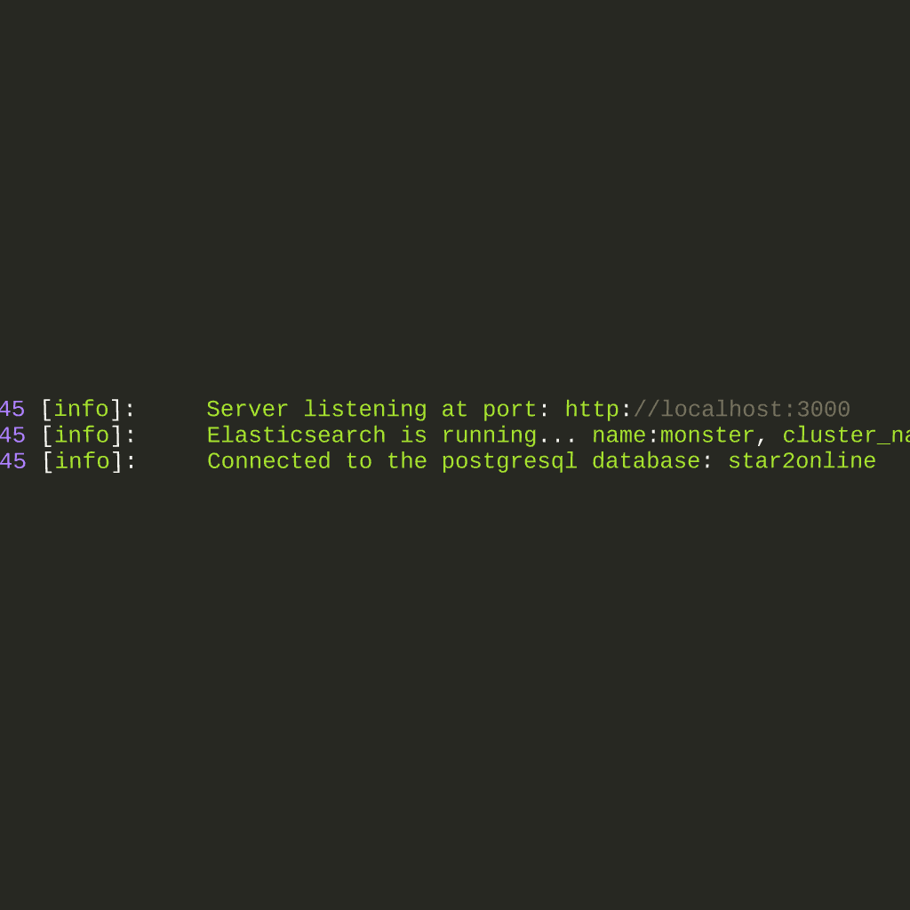
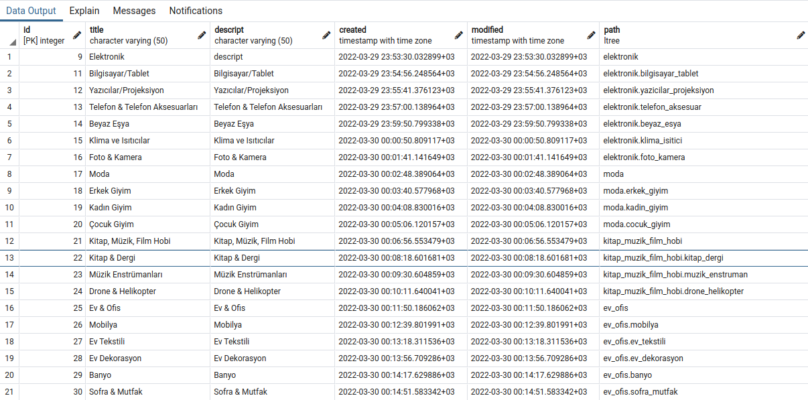
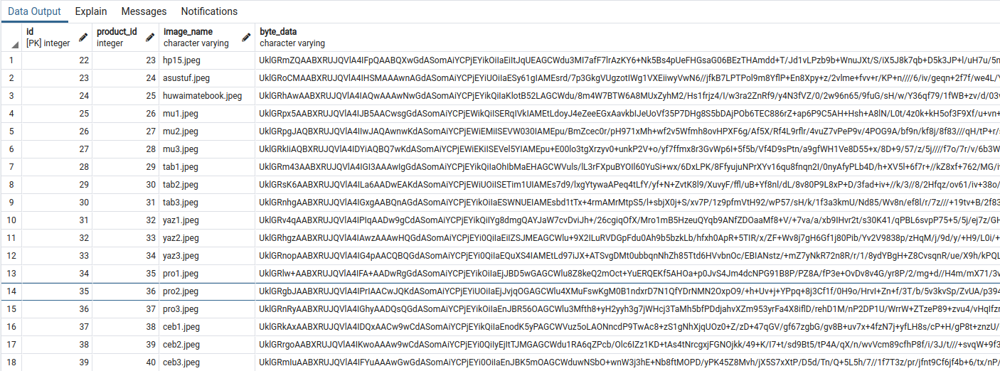

[](https://classroom.github.com/online_ide?assignment_repo_id=7366148&assignment_repo_type=AssignmentRepo)
# Logo Siber Güvenlik ve Ağ Teknolojileri Full Stack Bootcamp Bitirme Projesi

- Tek sayfadan oluşacak bir e-ticaret sitesi

## Proje Detayları:

- Vue.js ile tek sayfadan oluşan bir e-ticaret sistemi tasarlayacağız. -> Çoklu sayfalara dağıtıldı. Tamamlandı
- 10 adet kategori olacak. -> Daha fazla kategori ve agaç yapılı hiyerarşi. Tamamlandı
- Tüm backend işlemleri Node.js ile yapılacak. -> Tamamlandı
- Arayüz Vue.js ile yapılacak.  -> Tamamlandı
- Ürünler API’den çekilecek. İstenilen API kullanılabilir. API’yi kendiniz tasarlayabilirsiniz. -> Tamamlandı
- ElasticSearch ile ana sayfada arama alanı yapılacak. -> Tamamlandı
- Winston kullanılacak. ->Tamamlandı
- Ürüne tıkladığımız zaman bir kutusu ekrana gelecek ve ürünün bilgileri yer alacak. -> Her ürün kendi detay sayfasında açılıyor. Tamamlandı.
- Relational veritabanı için PostgreSQL kullanılacak. -> Tamamlandı.


Not: Projelerin görselleri kendi ana dizinlerindeki readme dosyalarında bulunabilir.


## Tüm projeleri indirmek için

```tex
git clone git@github.com:171-Logo-Siber-FullStack-Bootcamp/graduation-project-mehmethakan0220.git
```


### Projenin Ana Görünümü




### Secure pasword storing hash+salt

```sql
let sql = "INSERT INTO admin_user(email, pass, first_name, last_name, type_id) VALUES($1, crypt($2, gen_salt('bf', 12)), $3, $4, $5) RETURNING id, email, first_name, last_name";
```


### Hierarchical category tree with ltree




### Images kept in database




### Tokenization with JWT

```javascript
app.use(expressJWT({
    secret: config.jwt.secret,
    algorithms: config.jwt.algorithms
}).unless({path:[
    "/", "/api/login","/api/register",
    /^\/api\/.*/ /* full access */
]})
)
```


### Logging with Winston

```javascript
const logger = createLogger({
    format:combine(
        colorize(),
        timestamp(),
        align(),
        json(),
        printf((info)=>{
            const {timestamp, level, message , ...args}  = info;
            const ts = timestamp.slice(0, 19).replace('T', ' ');
            return `${ts} [${level}]: ${message} ${Object.keys(args).length ? "\t\t details:"+JSON.stringify(args, null, 0) : ''}`;
        })
    ),
    transports:[
        new transports.File({filename: 'system.log'}),
        new transports.Console(),
    ]
})

module.exports = {logger}
```


### Card functions

```javascript
async function create(body){
    let cardItem = await isExists(body.product_id,body.card_owner);
    if(cardItem){
        return await updateCount(body);
    }
    let sql = "INSERT INTO sepet ( card_owner, product_id, quantity, title, descript,  price, discount_id  ) VALUES($1, $2, $3, $4, $5, $6, $7) RETURNING *";
    let values = [body.card_owner, body.product_id, body.quantity, body.title, body.descript, body.price, body.discount_id ];
    let result;
    try {
        result = await db.oneOrNone(sql,values);
    } catch (error) {
        logger.error(`create failed.`,{"file":__filename,message:error.message});
    }
    return result;
}
```


### Ltree  anchestor & descendant queries

```javascript
async function getAll(){
    let sql = 'SELECT * FROM product_category WHERE nlevel(path) =1'
    let result;
    try {
        result = await db.any(sql);
    } catch (error) {
        logger.error(`getAll failed.`,{"file":__filename,message:error.message});
    }
    return result;
}

async function getByPath(path){
    let sql = 'SELECT * FROM product_category WHERE $1 @> path'
    let result;
    try {
        result = await db.any(sql,path); 
    } catch (error) {
        logger.error(`getByPath failed.`,{"file":__filename,message:error.message});
    }
    return  result;
}
```


### Routing

```javascript
/* product crud operations */
router.get("/product",                    productController.getAll);
router.put("/product",                    productController.update);
router.post("/product",                   productController.create);
router.delete("/product",                 productController.delete);
router.get("/product/:id",                productController.getById);
router.get("/product/categoryid/:id",     productController.getByCategoryId);
router.get("/product/categorypath/:path", productController.getByCategoryPath);
/*product search with elastic*/
router.get("/products",                   productController.elasticSearchGetAll);
router.post("/products",                  productController.elasticSearch);


/* sepet crud operations */
router.get("/sepets",           sepetController.getAll);
router.post("/sepet",          sepetController.create);
router.delete("/sepet",        sepetController.delete);
router.post("/sepet/all",       sepetController.getById);

/* image crud operations */
router.get("/images",           imagesController.getAll);
router.get("/images/:id",       imagesController.getById);
router.post("/images", upload.array('images', 12), imagesController.create);
router.delete("/images",        imagesController.delete);
router.post("/images/:id",      imagesController.getByProductId);
router.delete("/images",        imagesController.deleteProductImages);
```

